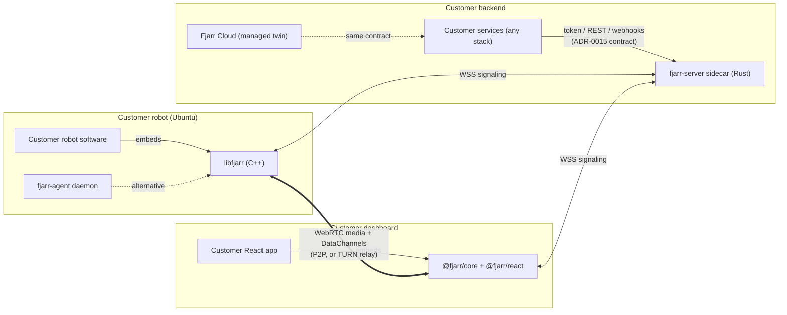

## The organizing principle: three embeddable libraries

Fjarr is not an application; it is three libraries a robot company embeds into
systems they already have, each paired with a thin reference binary and a
separated demo application.



Rules that keep this honest:

1. **Demos-as-integration-tests.** `demos/demo-robot`, `demos/demo-backend`,
   `demos/demo-dashboard` play the customer's role and may consume **only
   public APIs and the ADR-0015 contract**. If a demo needs a private hook,
   the public API is wrong.
2. **The customer's backend stays out of the hot path.** It mints session
   grants and receives webhooks; signaling and media never route through it.
3. **The customer's identity is canonical.** Fjarr authenticates *their*
   robot IDs and user identities; it never invents parallel ones.

## Control plane vs media plane

On the robot, Fjarr separates two concerns into separately supervisable
units (the fleet-daemon seam — [prior art](11-prior-art.md#fleet-daemon)):

- **Control plane** — signaling connection, session lifecycle, capability
  registry, store-and-forward event queue, OTA orchestration (later). Small,
  restartable, holds no media state.
- **Media plane** — GStreamer producer pipeline + per-session consumer
  pipelines. The part most likely to hit driver/hardware trouble; it can be
  torn down and rebuilt without dropping the control plane.

A lock or claim held by the media plane must **fail open on staleness**: a
dead process may never leave a robot permanently "owned"
([docs/10](10-security.md#session-ownership)).

## The media model: produce once, fan out

Adopted from the proven camera-streamer v3 design
([prior art](11-prior-art.md#camera-streamer)):

```text
capture ─ encode ─ appsink ──► FrameHub ──► per-session pipelines
(one producer, persistent)    (fan-out)     appsrc ! queue(leaky) ! valve
                                            ! rtp*pay ! webrtcbin
```

- N viewers cost **one** encoder; session churn never touches capture.
- Per-track `valve` enables/disables streams **without renegotiation**;
  re-enable waits for a keyframe.
- Offers are **caps-gated**: created only when every enabled track has fixed
  RTP caps (payload type + SSRC), eliminating the classic `webrtcbin` race.
- Every external callback is marshaled onto one main loop; callback contexts
  carry a per-session **generation counter** so late callbacks from a torn
  down session are no-ops.

The cost model (what is shared, what is per viewer, the zero-copy
guarantee, why a hub rather than a `tee` in one pipeline) is in
[docs/23](23-agent-core-architecture.md#fan-out). Whether
`webrtcbin`+FrameHub stays hand-rolled or is replaced by `webrtcsink`
(which ships congestion control and fan-out natively) is decided by
measurement in M1 — [ADR-0007](adr/0007-webrtcbin-vs-webrtcsink.md).

## Session lifecycle

```mermaid
sequenceDiagram
  participant D as Dashboard (@fjarr/react)
  participant B as Customer backend
  participant S as fjarr-server
  participant A as Agent (libfjarr)
  D->>B: user clicks "connect" (customer auth)
  B->>B: mint session grant (JWT: tenant, robot, capabilities, exp)
  B-->>D: grant
  D->>S: WSS connect + session-request(grant)
  S->>S: verify grant signature + expiry
  S->>A: session-request(session_id, capabilities)
  A->>A: build consumer pipeline, wait for fixed caps
  A->>S: offer(sdp, track manifest)
  S->>D: offer
  D->>S: answer(sdp)
  S->>A: answer
  A-->>D: trickle ICE both ways (via S)
  A-->>D: DTLS/SRTP established — media + DCs flow P2P
  S->>B: webhook: session.started
  Note over A,D: heartbeat on control DC; reconnect/ICE-restart on failure
  S->>B: webhook: session.ended(reason, stats)
```

## Deployment topologies

| Topology | Media path | When |
|---|---|---|
| LAN direct | host↔host | Commissioning, factory |
| STUN P2P | NAT-traversed direct | Most field robots |
| TURN relay | robot → coturn → operator | Symmetric NAT, carrier-grade NAT, strict firewalls — **plan capacity for this** ([docs/16](16-performance-budgets.md)) |

Signaling always flows through `fjarr-server` (WSS, 443-friendly). TURN uses
ephemeral HMAC credentials minted per session ([docs/10](10-security.md)).

The operator end is a browser for every capability but one. The
[network tunnel](27-network-tunnel.md) needs a network interface, which a
browser cannot create, so it is driven by `fjarr-connect` — a native binary
speaking the same signaling and the same session protocol, with data channels
only and no media ([ADR-0024](adr/0024-native-operator-client.md)). It is a
fourth consumer of the protocol, not a fourth tier: it embeds nothing and
nobody integrates against it.

A tunnel link is point-to-point and terminates at the operator host. Two
robots attached at once are two independent links with no path between them
([docs/27](27-network-tunnel.md#isolation)) — a fleet is not a network of
peers, and Fjarr never makes it one.

## Trust boundaries

1. **Browser ↔ fjarr-server**: session grant required; grants are short-lived
   and capability-scoped.
2. **Agent ↔ fjarr-server**: per-device credential established at enrollment
   ([docs/10](10-security.md#device-identity)); never a fleet-shared secret.
3. **fjarr-server ↔ customer backend**: signed webhooks out, authenticated
   REST in.
4. **Inside the robot**: the agent runs unprivileged; input injection that
   needs privileges goes through a minimal separate helper
   ([ADR-0009](adr/0009-privilege-separation.md)). The tunnel interface is
   created once at install and attached by the same unprivileged user, so the
   agent never holds `CAP_NET_ADMIN`
   ([docs/27](27-network-tunnel.md#lifecycle)).
5. **Across a tunnel link**: whatever the robot binds is reachable to an
   operator holding a `net` grant, so the grant is treated as
   shell-equivalent ([docs/10](10-security.md#network-tunnel)). Both ends drop
   packets not addressed to their own tunnel address, so the boundary is the
   robot, never the network behind it.

## Codebase ↔ spec map

| Component | Language | Specs it implements |
|---|---|---|
| `agent/` (`libfjarr`, `fjarr-agent`) | C++20 | 05, 06, 07, 08, 09, 16 |
| `signaling/` (`fjarr-signaling`, `fjarr-server`) | Rust | 08, 09, 10 |
| `web/packages` (`@fjarr/core`, `@fjarr/react`) | TypeScript | 05, 08, 09 |
| `demos/*` | C++/TS | 02 (demo rule), 09 |
